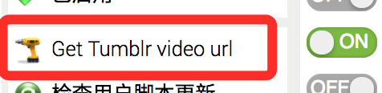

# Tumblr video url inspector for Tampermonkey

Get video url in blog of Tumblr.

## In dashboard

Will add a icon after `like` icon in control are of a post

## In a single video blog

Click Tampermonkey icon and click `tumblr video url`

